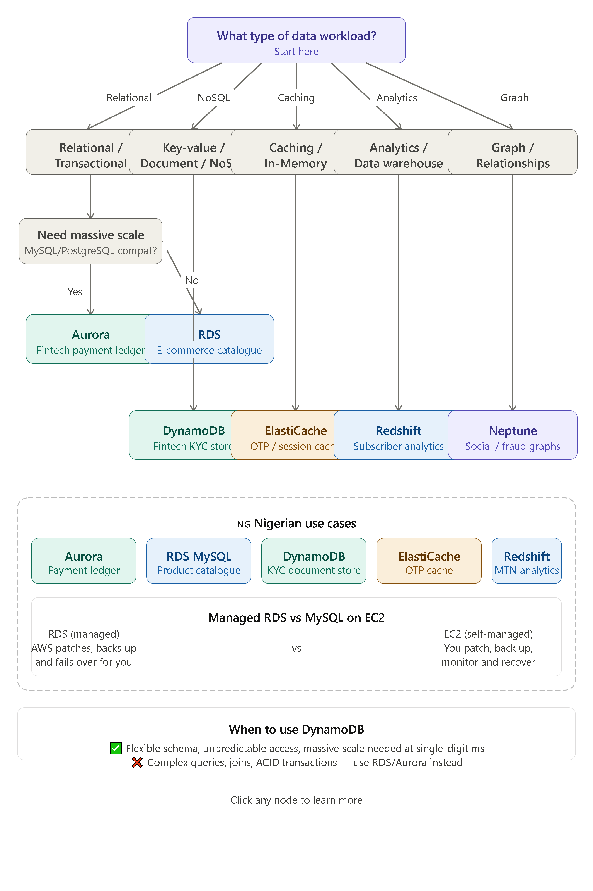

# AWS Database Selection — Decision Tree

A visual decision tree for selecting the right AWS database service based on workload type. Built as part of the AWS Cloud Accelerator — Week 6, Day 1.

---

## Decision Tree

---

## When to Use DynamoDB

Use DynamoDB when your data has a flexible or unpredictable schema and you need single-digit millisecond performance at any scale — for example, a fintech KYC document store where each customer's data fields may differ. Do not use DynamoDB when your workload requires complex joins, multi-table transactions, or SQL-style reporting — in those cases, RDS or Aurora is the better fit.

---

## Nigerian Use Cases

| AWS Database | Nigerian Business Use Case |
|---|---|
| Aurora | Payment ledger for a fintech (ACID transactions) |
| RDS MySQL | E-commerce product catalogue |
| DynamoDB | KYC document store (flexible schema) |
| ElastiCache | OTP/session cache for banking apps |
| Redshift | MTN/Airtel subscriber analytics |

---

## Managed RDS vs MySQL on EC2

| | RDS (managed) | MySQL on EC2 (self-managed) |
|---|---|---|
| Patching | AWS handles it | You handle it |
| Backups | Automated | You set it up |
| Failover | Automatic | You configure it |
| Cost | Higher | Lower upfront |
| Recommended | Most teams | Advanced teams only |

---

*Project completed as part of the AWS Cloud Accelerator — Week 6, Day 1.*
